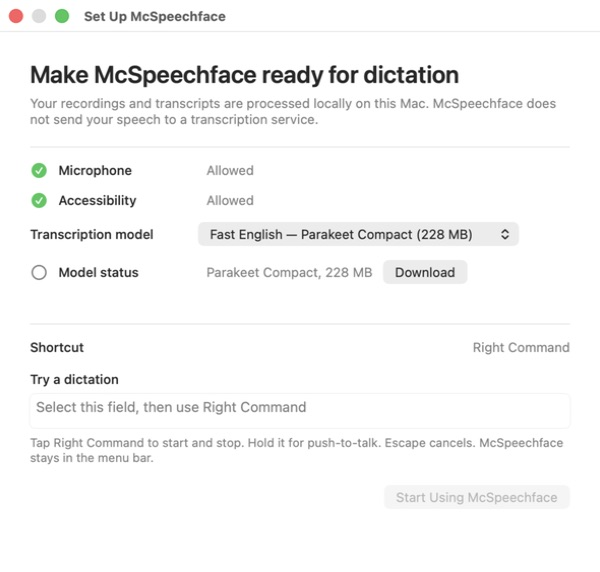
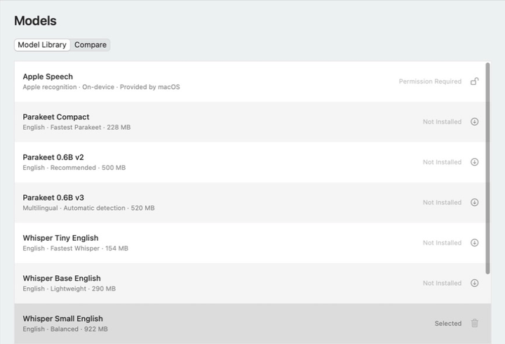
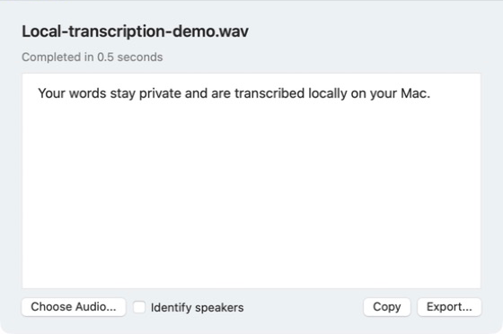
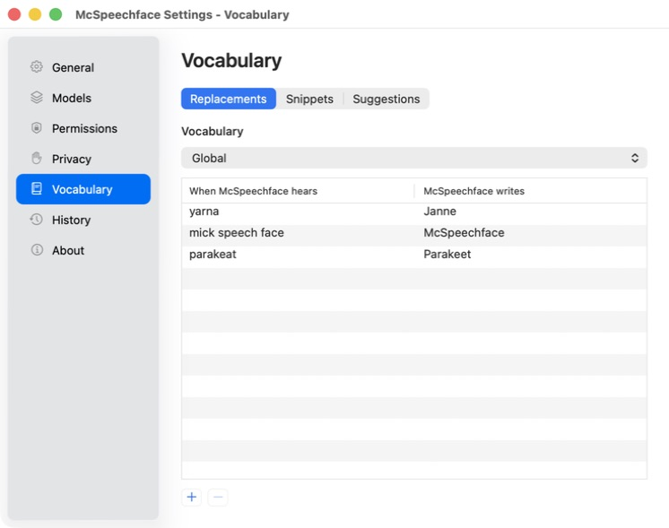
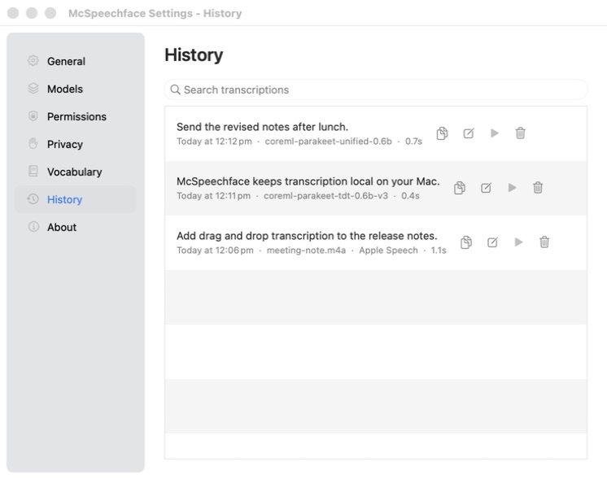

<p align="center">
  
</p>

<h1 align="center">McSpeechface</h1>

<p align="center"><strong>Private, fast speech-to-text for Apple Silicon Macs.</strong></p>

<p align="center">
  <strong><a href="https://github.com/hughleat/mcspeechface/releases">Download the latest Public Beta (.dmg)</a></strong>
  · <a href="#install">Install</a>
  · <a href="#your-first-dictation">First dictation</a>
  · <a href="https://github.com/hughleat/mcspeechface/issues/new/choose">Feedback</a>
  · <a href="LICENSE">MIT License</a>
</p>

<p align="center"><sub>M1 or newer · macOS 14 Sonoma or later · no account · works offline</sub></p>

McSpeechface is a native menu-bar app that records your voice, transcribes it entirely
on your Mac, and automatically pastes the result when the destination accepts
it. If pasting fails, the transcript remains on the clipboard. McSpeechface is free and
open source. Its mascot is Speechy McSpeechface.

<p align="center">
  
  <br><sub>McSpeechface records first, then transcribes and attempts to paste after you stop. It does not type live.</sub>
</p>

## Install

**Before downloading:** the current beta requires macOS Accessibility access
for its global shortcut and paste workflow. The table below explains exactly
how McSpeechface uses this broad permission.

1. [Download the latest beta](https://github.com/hughleat/mcspeechface/releases), open its DMG, and drag McSpeechface to Applications.
2. Open **McSpeechface**. When macOS shows its unidentified-developer warning, open **System Settings > Privacy & Security**, choose **Open Anyway**, then confirm **Open**.
3. In setup, allow the required permissions and select **Fast English — Parakeet Compact**. Choose **Download**, wait for it to finish, try a dictation in the setup field, then select **Start Using McSpeechface**.

The DMG is about 12 MB and the installed app is about 30 MB. Speech models are not
bundled: Parakeet Compact is a separate 228 MB download, and McSpeechface downloads
only models you explicitly choose. Once a model is installed, dictation works
without an internet connection.

### Updating from an earlier beta

Quit the older app before installing McSpeechface. On its first launch,
McSpeechface moves existing downloaded models, history, vocabulary, snippets,
and settings into its new application identity. The models are moved in place,
not copied, so the upgrade does not require several gigabytes of extra disk
space. macOS will ask you to approve Microphone, Accessibility, and, if you use
Apple Speech, Speech Recognition again because the application identity has
changed. Reinstall the command-line tool from
**Settings > General** if you previously used it; McSpeechface removes the
owned earlier command link during installation. After confirming your models
and settings are present, enable **Launch McSpeechface at login** again if you
used it before; remove any earlier entry still shown in **System Settings >
General > Login Items**. Then remove the older app from Applications. If migration
cannot finish safely, McSpeechface leaves unresolved earlier items untouched,
shows a warning without starting normally, and retries on its next launch.

<p align="center">
  
</p>

### Permissions

| Permission | Why McSpeechface needs it | When it is needed |
| --- | --- | --- |
| **Microphone** | Records the speech you ask McSpeechface to transcribe. | Required by the current setup. |
| **Accessibility** | Detects the global shortcut, attempts to restore the original app, refuses to auto-paste into secure fields, and sends Paste. To confirm the paste, McSpeechface may briefly read the focused field's selected range, text, or character count in memory; it does not save or transmit that information. | Required by the current setup for the global shortcut and automatic paste. |
| **Speech Recognition** | Lets macOS perform on-device recognition. | Only when you select Apple Speech. |

Accessibility is a broad macOS permission, even though McSpeechface uses it for this
narrow workflow. Temporary microphone files are normally deleted when an
operation finishes; leftovers from a crash or forced quit are removed the next
time McSpeechface launches. **Keep recordings** is off on new installations.

### Why macOS warns

The free community DMG does not use Apple's paid Developer ID and notarization
service, so macOS asks you to approve each downloaded version once. This is the
standard unidentified-developer warning, not a malware finding. McSpeechface's source,
[release workflow](.github/workflows/release.yml), and build instructions are
public, and every release includes a SHA-256 checksum.

McSpeechface is an independent project maintained by
[Hugh Leather](https://github.com/hughleat). It is currently a public beta:
dictation is working, but bugs and application compatibility problems are still
possible. Keep the original audio for an important imported recording and
[report anything surprising](https://github.com/hughleat/mcspeechface/issues/new/choose).
Only the [latest published beta](https://github.com/hughleat/mcspeechface/releases)
receives security fixes.

<details>
<summary>Verify the downloaded DMG (optional)</summary>

Download the `.sha256` file beside the DMG on the
[release page](https://github.com/hughleat/mcspeechface/releases), then run the command
below with the downloaded DMG's actual filename:

```sh
shasum -a 256 ~/Downloads/McSpeechface-*.dmg
```

The long value printed by `shasum` should match the value in the `.sha256`
file. This confirms that your download matches the file published by the
project.
</details>

## Your First Dictation

1. Open TextEdit, Notes, Mail, or another application and place the cursor in a normal text field.
2. Tap Right Command. McSpeechface's red recording panel appears.
3. Speak, then tap Right Command again.
4. McSpeechface shows **Transcribing**, then attempts to restore the original application and paste at the cursor.

Text appears after recording stops; live transcription is not currently part
of McSpeechface. Hold Right Command instead for push-to-talk, releasing it when you
finish. Press Escape to cancel without transcribing.

McSpeechface stays in the menu bar and has no Dock icon. Its waveform menu lets you
record, change models, open Settings, or quit. You can change the shortcut and
turn off **Paste after transcription** in **Settings > General**. A completed
transcript is still copied to the clipboard if automatic paste fails.

Corrections can run **Automatically**, **On request**, or be **Off**. In On
request mode, McSpeechface shows the transcript immediately: Right Command accepts it
and Option + Right Command repairs it with the selected correction model. Choose
**Add more**, or hold Option + Right Command, to append another recording. Added
speech stays uncorrected in transcript mode; after a repair, it is included in a
new repair. The preview keeps the accumulated original and revised text available
before you paste.

## Privacy

- **Local transcription:** Parakeet and Whisper run on your Mac. McSpeechface requires Apple Speech to use its on-device mode; if that mode is unavailable for a language, McSpeechface will not use Apple Speech for it.
- **Temporary audio:** Microphone files are normally deleted when transcription ends unless **Keep recordings** is enabled. Interrupted-run leftovers are removed at the next launch.
- **History off by default:** McSpeechface does not save transcript history or recordings on a new installation. If enabled, retention defaults to 30 days and can be set to 1, 7, 30, or 90 days, or forever, in **Settings > Privacy**. Retained audio can consume substantial disk space.
- **Clipboard:** Successful auto-paste temporarily uses the clipboard, then restores its previous contents when McSpeechface can confirm the paste and the clipboard has not changed meanwhile. If auto-paste is off or fails, the transcript stays on the clipboard and may be available to other software or macOS Universal Clipboard.
- **No tracking:** McSpeechface has no accounts, telemetry, advertising, or built-in crash reporting.
- **Limited network use:** McSpeechface connects when you request a model download and, by default, checks GitHub Releases once a day for updates. Automatic checks can be turned off in **Settings > About**.
- **Optional external correction:** Local correction models and Apple Intelligence keep transcript text on your Mac. If you explicitly choose Codex, Claude, or a custom command as the correction provider, that provider may send the transcript and correction prompts to its configured service. McSpeechface labels these providers as potentially off-device; their own terms and privacy policies apply.

Parakeet and speaker-identification models are fetched from public Hugging Face
repositories through FluidAudio; Whisper models come from Argmax's public
WhisperKit repository on Hugging Face. Those services receive ordinary
connection information such as your IP address during a download. Speech and
transcripts are not uploaded as part of model downloads. After downloading, McSpeechface checks
that the expected model components are present before activating the model; it
does not publish independent checksums for upstream model files.

Downloaded models live in `~/Library/Application Support/McSpeechface/Models/coreml/`.
History, optional recordings, vocabulary, snippets, and privacy settings live
in `~/Library/Application Support/McSpeechface/data/`. McSpeechface's diagnostics report
excludes transcripts, audio, clipboard contents, vocabulary, file paths, and
application names.

## Models

| Need | Suggested model | Download |
| --- | --- | ---: |
| Fast everyday English | Parakeet Compact | 228 MB |
| Larger English Parakeet | Parakeet 0.6B v2 | 500 MB |
| New punctuated English model | Parakeet Unified English | 615 MB |
| 25 European languages | Parakeet 0.6B v3 | 520 MB |
| No McSpeechface-managed download | Apple Speech | None |

For everyday English, start with Compact; v2 provides the established larger
English-only Parakeet model. Unified is a newer English model with punctuation
and capitalization built into its recognition output. Choose v3 for automatic
detection across its
[supported European languages](https://github.com/FluidInference/FluidAudio/blob/main/Documentation/ASR/GettingStarted.md).
Apple Speech avoids a McSpeechface-managed model download but requires macOS Speech
Recognition permission and on-device support for the selected language.

Depending on your Mac, McSpeechface also offers English and multilingual Whisper Tiny,
Base, and Small models, plus Distil Whisper Large V3, Whisper Large V3, and
Whisper Large V3 Turbo. Install, compare, and remove models in **Settings >
Models**.

<p align="center">
  
  <br><sub>The library shows each model's download size and installation state; the selected model can be changed at any time.</sub>
</p>

## Do More

Choose **Transcribe Audio File...** from the waveform menu or drop an audio
file into the transcription window. McSpeechface can export text, Markdown, and JSON,
plus SRT and VTT when timestamps are available. Speaker identification requires
a timestamp-capable speech model and the separately installed **Speaker
Identification** model.

<p align="center">
  
  <br><sub>Transcribe existing audio and optionally identify speakers.</sub>
</p>

Vocabulary rules fix names and specialist terms automatically. McSpeechface also
supports reusable snippets, spoken formatting, learned suggestions, and
different vocabulary for individual applications.

<p align="center">
  
  <br><sub>Teach McSpeechface names, product terms, and other custom spellings.</sub>
</p>

Turn on **Save transcription history** in **Settings > Privacy** to search,
copy, correct, or delete previous results. Enable **Keep recordings** as well
for replay and model comparison.

<p align="center">
  
  <br><sub>Your optional transcription history stays on your Mac.</sub>
</p>

## Remove McSpeechface

1. If installed, remove the command-line link with **Settings > General > Command Line > Uninstall**.
2. Turn off **Launch McSpeechface at login** in **Settings > General**.
3. Choose **Quit McSpeechface** from its waveform menu, then move McSpeechface from Applications to the Trash.
4. To remove downloaded models and personal data, open Finder's **Go > Go to Folder...** and delete `~/Library/Application Support/McSpeechface`.
5. Turn off McSpeechface's Microphone, Accessibility, and Speech Recognition access in **System Settings > Privacy & Security**.

For a completely clean removal, you can also delete
`~/Library/Preferences/com.hughleat.mcspeechface.plist` and
`~/Library/Caches/McSpeechface`.

## More

- [Use McSpeechface from the command line](docs/COMMAND_LINE.md)
- [See what has changed](CHANGELOG.md)
- [See ideas under consideration](docs/ROADMAP.md)
- [Build McSpeechface from source](docs/DEVELOPMENT.md)
- [Read the beta testing guide](docs/BETA_TESTING.md)
- [Report a bug or suggest an improvement](https://github.com/hughleat/mcspeechface/issues/new/choose)
- [Report a security problem privately](SECURITY.md)

## License

McSpeechface is available under the [MIT License](LICENSE). Dependency and model
attributions are listed in [Third-Party Notices](THIRD_PARTY_NOTICES.md).
